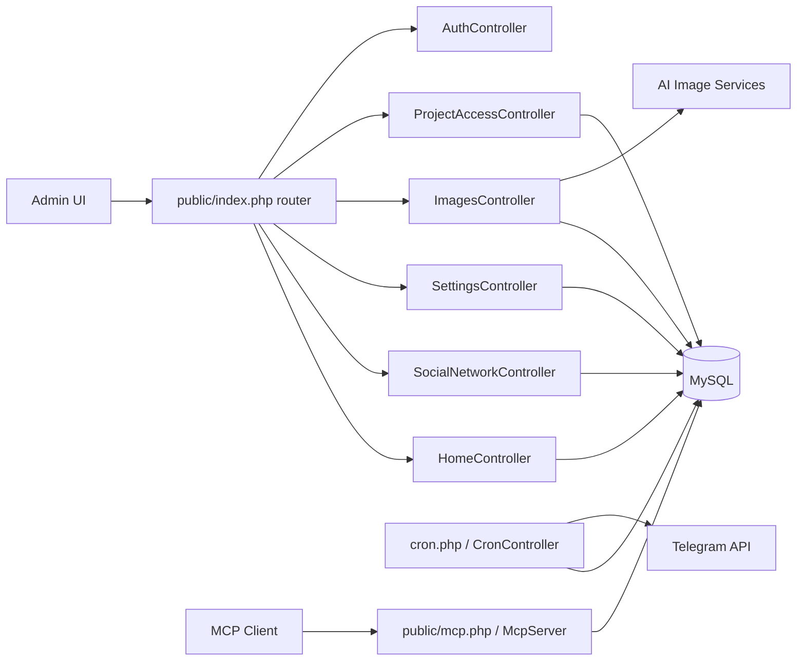

# Content Planner Bot: повний технічний опис системи

Дата актуалізації: 2026-05-20

## 1. Огляд системи
Content Planner Bot — веб-система керування контент-планом для кількох соціальних мереж із багатопроєктною моделлю доступу.

Система вирішує 6 задач:
1. Планування постів у календарі за датами.
2. Керування категоріями контенту для кожної мережі.
3. Ізоляція даних по проєктах (multi-project).
4. Автоматичне щоденне надсилання плану в Telegram.
5. Робота із зображеннями (source/generate/fallback AI).
6. Інтеграція із зовнішніми інструментами через MCP (JSON-RPC).

## 2. Межі та призначення модулів

### 2.1. Backend
- Мова: PHP.
- Архітектурний стиль: MVC (без стороннього фреймворку).
- Доступ до БД: PDO через власний шар `Database`.

### 2.2. База даних
- СУБД: MySQL/MariaDB.
- База: key domain tables + settings + ACL таблиці.

### 2.3. Інтеграції
- Telegram Bot API для розсилок.
- AI image providers для генерації візуалів.
- MCP endpoint для машинного доступу до даних/операцій.

## 3. Структура репозиторію
- `cron.php` — CLI/web entrypoint для cron-задач.
- `php-mvc/public/index.php` — front controller і маршрутизація.
- `php-mvc/public/mcp.php` — MCP endpoint.
- `php-mvc/public/run-migrations.php` — web міграції.
- `php-mvc/app/core` — ядро (`Database`, `BaseController`, `McpServer`).
- `php-mvc/app/controllers` — прикладна логіка.
- `php-mvc/app/views` — шаблони інтерфейсу.
- `php-mvc/db/schema.sql` — SQL схема.
- `php-mvc/config/*.php` — конфіги БД, MCP, Telegram.

## 4. Архітектурна схема

## 5. Основні підсистеми

### 5.1. Аутентифікація та сесії
- Вхід/вихід: `AuthController`.
- Сесійний guard для приватних сторінок.
- Таблиця користувачів: `admin`.

### 5.2. Multi-project і ACL
- Проєкти: `projects`.
- Доступи: `admin_projects` (зв’язок admin-to-project).
- Вибір активного проєкту: через сесію `active_project_id` у `BaseController`.

### 5.3. Контент-план
- Сутність поста: таблиця `posts`.
- Фільтри: проєкт, дата, мережа.
- CRUD постів + метаполя (тип поста, параметри картинки тощо).

### 5.4. Соцмережі й категорії
- Мережі: `social_networks` (prompt, is_enabled, sort_order).
- Категорії: `categories` (прив’язка до проєкту + мережі).
- Автосід дефолтних мереж при першому запуску.

### 5.5. Зображення
- Джерела: `uploads/source_images/<project-folder>/`.
- Результати: `uploads/generated_images/<project-folder>/`.
- Генерація 5 варіацій з ротацією сервісів і fallback.

### 5.6. Cron + Telegram
- `daily-posts`: щоденний збір постів на сьогодні та надсилання в Telegram.
- `test`: тест каналу доставки.
- Підтримка авто-генерації картинки перед відправкою, якщо потрібно.

### 5.7. MCP API
- Endpoint: `php-mvc/public/mcp.php`.
- Сервер: `McpServer`.
- Формат: JSON-RPC (`initialize`, `tools/list`, `tools/call`, `ping`).

## 6. Модель даних

### 6.1. Таблиці
1. `admin`
2. `projects`
3. `admin_projects`
4. `social_networks`
5. `categories`
6. `posts`
7. `settings`

Додатково в системі використовується таблиця `image_prompts` (створюється окремими міграціями/скриптами).

### 6.2. Ключові зв’язки
- `admin_projects.admin_id -> admin.id`
- `admin_projects.project_id -> projects.id`
- `categories.project_id -> projects.id`
- `categories.social_network_id -> social_networks.id`
- `posts.category_id -> categories.id`
- `posts.social_network_id -> social_networks.id`
- `settings.project_id -> projects.id`

### 6.3. Мультипроєктна ізоляція
Дані логічно відокремлені через `project_id`. На рівні контролерів більшість запитів працює в межах активного проєкту з сесії.

## 7. HTTP маршрути (укрупнено)

### 7.1. Контент-план
- `GET /` — головний екран плану.
- `POST /content-plan/*` — операції над постами/категоріями/параметрами картинок.

### 7.2. Обліковий доступ
- `GET/POST /login`
- `GET /logout`

### 7.3. Соцмережі
- `GET /social-networks`
- `GET/POST /social-networks/edit`
- `POST /social-networks/status`
- `POST /social-networks/import-content`
- `GET /social-networks/export-content`

### 7.4. Зображення
- `GET /images`
- `POST /images/upload`
- `POST /images/generate-variations`
- `POST /images/add-prompt`
- `POST /images/delete-prompt`
- `POST /images/delete`

### 7.5. Доступ до проєктів
- `GET /project-access`
- `POST /project-access/save`
- `POST /projects/create`

### 7.6. Cron web endpoints
- `GET /cron/daily-posts`
- `GET /cron/test`

### 7.7. MCP
- `POST /mcp`

## 8. Алгоритми та бізнес-логіка

### 8.1. Вибір активного проєкту
1. Отримати всі доступні проєкти адміна.
2. Якщо передано `project_id` і доступ дозволений — встановити в сесію.
3. Якщо активний не задано — обрати перший доступний.

### 8.2. Daily posts в Telegram
1. Вибрати активні проєкти з налаштованими `telegram_bot_token` і `telegram_chat_id`.
2. Для кожного проєкту витягнути пости на поточну дату.
3. Згрупувати за соцмережами.
4. За потреби згенерувати картинку (`image_action = auto_generate`).
5. Надіслати текст/медіа в Telegram.

### 8.3. Генерація варіацій зображень
Для кожного з 5 варіантів пробується ланцюжок:
1. Pollinations
2. DeepAI
3. Hugging Face
4. Craiyon
5. Local processing (GD fallback)

## 9. Конфігурація

### 9.1. База даних
Файл: `php-mvc/config/database.php`.
Містить host/db/user/pass/charset.

### 9.2. Telegram
Файл: `php-mvc/config/telegram.php` (або per-project поля в `settings`).

### 9.3. MCP
Файл: `php-mvc/config/mcp.php`.
- `token`
- `allowed_origins`
- `default_limit`

## 10. Міграції і запуск

### 10.1. Початковий запуск
1. Налаштувати БД у `config/database.php`.
2. Виконати міграції (`run-migrations.php` або SQL вручну).
3. Переконатися, що є хоча б один admin і один project.
4. Прив’язати admin до project у `admin_projects`.

### 10.2. Команди обслуговування
- `php cron.php help`
- `php cron.php test`
- `php cron.php daily-posts`

## 11. Експлуатаційні сценарії

### 11.1. Контент-менеджер
1. Логін.
2. Вибір проєкту.
3. Додавання/редагування постів за датами.
4. Ручне або авто керування картинками.

### 11.2. Адміністратор
1. Налаштування мереж і категорій.
2. Налаштування Telegram credentials і папки зображень.
3. Керування доступами між адмінами та проєктами.

### 11.3. Інтегратор
1. Підключення до MCP endpoint.
2. Виклик `tools/list`.
3. Використання `tools/call` для операцій із проєктами/постами/категоріями.

## 12. Відомі технічні ризики
1. Секрети збережені у файлах конфігурації (ризик витоку).
2. `run-migrations.php` має пароль у коді.
3. Router у `public/index.php` масштабно росте через `if/elseif`.
4. Частина POST дій без централізованого CSRF шару.
5. Відсутній єдиний стандарт логування та моніторингу.

## 13. Рекомендований план покращень

### 13.1. Безпека (високий пріоритет)
1. Винести секрети у environment variables.
2. Обмежити доступ до міграційних скриптів (IP allowlist/basic auth/remove from public).
3. Додати CSRF токени на всі модифікуючі форми.

### 13.2. Архітектура (середній пріоритет)
1. Впровадити централізований роутер.
2. Винести валідацію запитів в окремий шар.
3. Уніфікувати error handling + logging.

### 13.3. Якість (середній пріоритет)
1. Додати unit тести для контролерів і сервісів.
2. Додати smoke/integration тести для ключових маршрутів.
3. Описати контракт MCP tools у окремій API-специфікації.

## 14. KPI працездатності (операційні)
1. Частка успішних daily-posts розсилок за добу.
2. Середній час генерації 5 image варіацій.
3. Відсоток fallback на local processing.
4. Час відповіді MCP endpoint на `tools/list` і `tools/call`.

## 15. Короткий висновок
Система вже придатна до робочої експлуатації: має multi-project ACL, календарний контент-план, Telegram-автоматизацію, image pipeline та MCP інтеграцію. Для підвищення стабільності та безпеки першочергово потрібні управління секретами, hardening службових endpoint-ів і базовий security middleware.
